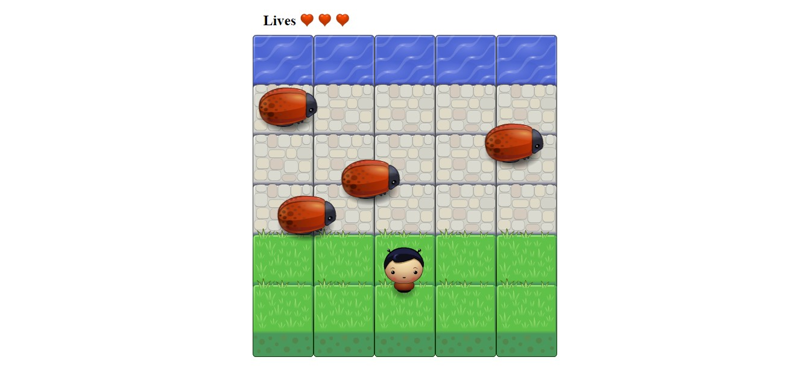

# Arcade Game
The goal of the game is to move the player as fast as it is possible in order to reach the water.

## Table of Contents

* [Start](#start)
* [Instructions](#instructions)
* [Compatibility](#contributing)
* [Dependencies](#contributing)
* [Contributing](#contributing)

## Start
In order to play the game, you should clone this repository to your local one and open the index.html file in your browser. Optionally, you can pay it here https://lexie14.github.io/arcade-game/

## Instructions

The main steps of the game are:
* tab to the browser window to make it active;
* use arrow keys on your keyboard (left, right, up and down) to move the player;
* the player has 3 lives (that is 3 attempts to win the game);
* move the player to reach the water zone without collision with the enemies;
* each collision with the enemy takes away one life and brings player to the initial position;

## Compatibility
This game works in Chrome and Safari.

## Dependencies
The project was built using HTML5, CSS3 and JavaScript as well as https://www.w3schools.com/js/default.asp and https://developer.mozilla.org/en-US/docs/Learn/JavaScript and https://stackoverflow.com/

